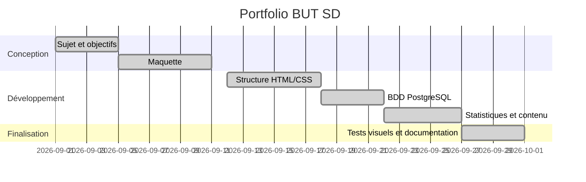

# Portfolio BUT Science des Données

Site portfolio (local) pour valoriser 3 années de BUT SD : projets, compétences, alternance et statistiques globales.

## Objectif

Construire un portfolio responsive, versionné sur GitHub, avec :
- une page d'accueil ;
- une section **Projets** ;
- une section **Alternance** ;
- des statistiques globales (heures, projets, compétences) ;
- un schéma de base de données PostgreSQL avec relations.

## Technologies

- HTML5
- CSS3 (charte graphique simple)
- JavaScript (rendu dynamique des statistiques/projets)
- PostgreSQL (modèle relationnel dans `schema.sql`)

## Structure du dépôt

- `/index.html` : structure du site
- `/style.css` : charte graphique + responsive
- `/script.js` : données et rendu des statistiques/projets
- `/schema.sql` : schéma PostgreSQL + relations

## Lancer le site en local

Depuis la racine du dépôt :

```bash
python -m http.server 8000
```

Puis ouvrir `http://localhost:8000`.

## Données intégrées

- **30h de formation** au total (à partir des séances fournies)
- **4 projets principaux**
- **4 compétences BUT SD** (C1, C2, C3, C4)
- compétences techniques (Python, SQL/PostgreSQL, R, HTML/CSS/JS, Git/GitHub, BI)

## Schéma BDD (résumé)

Le modèle relationnel couvre :
- l'étudiant (`student`) ;
- les compétences BUT (`competence`) ;
- les compétences techniques (`technical_skill`) ;
- les projets (`project`) ;
- les relations N-N projet↔compétence (`project_competence`) ;
- les relations N-N projet↔compétence technique (`project_skill`) ;
- l'alternance (`alternance_mission`).

Voir `schema.sql` pour le détail.

## Planning prévisionnel + suivi

| Tâche | Prévu | État | Commentaire |
|---|---|---|---|
| Définition du sujet | Semaine 1 | Terminé | Objectifs du portfolio définis |
| Maquette | Semaine 1-2 | Terminé | Sections principales validées |
| Structure HTML/CSS | Semaine 2 | Terminé | Base responsive en place |
| Partie serveur/BDD | Semaine 3 | Terminé | Schéma PostgreSQL défini |
| Intégration statistiques | Semaine 3-4 | Terminé | Heures/projets/compétences affichés |
| Finalisation docs | Semaine 4 | Terminé | README complété |

### Diagramme de Gantt (Mermaid)



## Maquette (wireframe textuel)

```text
+------------------------------------------------+
| HEADER (Nom + menu navigation)                 |
+------------------------------------------------+
| ACCUEIL: Présentation + objectif portfolio      |
+------------------------------------------------+
| STATISTIQUES: cartes (heures, projets, C1..C4) |
+------------------------------------------------+
| PROJETS: cartes projets + compétences associées |
+------------------------------------------------+
| ALTERNANCE: missions, outils, résultats         |
+------------------------------------------------+
| FOOTER                                          |
+------------------------------------------------+
```

## Gestion de projet et versionning

Bonnes pratiques utilisées :
- commits réguliers par étape cohérente ;
- messages de commit explicites ;
- documentation des choix dans ce README.

Exemples de messages de commit utiles :
- `init: structure de base du portfolio`
- `feat: ajout section statistiques globales`
- `feat: ajout schéma PostgreSQL et relations`
- `docs: ajout planning et diagramme de Gantt`

## Outils recommandés (GitHub Student Developer Pack + GitHub)

### Gestion de projet
- **GitHub Projects** : tableau Kanban (À faire / En cours / Terminé)
- **GitHub Issues** : tâches détaillées par fonctionnalité
- **Milestones** : jalons (maquette, V1, final)
- **Pull Requests** : revue des changements avant fusion

### Développement
- **GitHub Copilot (Student Pack)** : accélérer rédaction de code et docs
- **GitHub Codespaces (Student Pack)** : environnement cloud prêt à l'emploi
- **GitHub Actions** : vérifications automatiques (lint/tests si ajoutés)

### Maquette et planning
- **Figma / FigJam** (compte étudiant) : wireframes et maquettes
- **Mermaid** (dans README) : diagramme de Gantt versionnable
- **draw.io / diagrams.net** : schémas d'architecture et BDD

## Limites actuelles

- Site statique (pas encore connecté à une base PostgreSQL réelle).
- Les heures par compétence sont une première répartition pour visualiser la progression.
